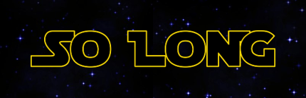

<div align="center">
	
</div>

<div align="center">
	<h1>Description</h1>
	<p>This project is one of the projects of the school 42 where the purpose is to build a small 2D game. You have to work with textures, sprites, and some gameplay mechanics.</p>
</div>

<div align="center">
	
</div>

<div align="center">
	<h1><a href="subject.pdf">Subject</a><h2>
</div>

## Features:
- Only allow the player to exit after collecting every collectible.
- After collecting a lightsaber, the player can attack the enemies (Bonus Part).
- Boss fight after defeating every enemy and collecting every collectible (Bonus Part).
- Animation (Bonus Part).

<div align="center">
	<h1><a>Documentation (WIP)</a></h1>
</div>

<div align="center">
	<h1>How to Play</h1>
</div>

### Step 1 / Clone Repo

```bash
$ git clone https://github.com/Dot99/42-so_long.git
```

### Step 2 / Install dependencies

```bash
$ cd 42-so_long
$ make download
```
Minilibx dependencies:
```bash
$ sudo apt-get update && sudo apt-get install xorg libxext-dev zlib1g-dev libbsd-dev
```

### Step 3 / Compile the program

```bash
$ make
```

### Step 4 / Run the program
The map folder has some pre-configured maps for you to test the game environment.  
You're able to create a map of your own and the program will tell you if the map is valid or not, pointing the out the problem if it isn't.  

<details>
<summary>Click here for map creation tutorial.</summary>
  
Map Rules:  
It has to be a **rectangular closed map** (walls around) and there needs to be a valid way to collect the health packs and to the exit.  
The map file extension has to be **'.ber'**.  
The map is composed by 5 elements:  
```
- '1' for walls;
- '0' for available floor;
- 'P' for Player starting position;
- 'E' for exit;
- 'C' for collectible;
```

Map example:
```
1111111111111111
1C0100000000C011
1000011111000001
1P0011E000001001
1000000000000001
1000000000000001
1111011100001001
10C0000C100000C1
1111111111111111
```
</details>

To run the program, you need to select a map from the existing ones or the one that you've created. For that, you need to put its filename, extension and directory.  
  
For *mandatory*:
```bash
$ ./so_long maps/map.ber
```

To exit the game, just press 'ESC' on your keyboard or click the 'X' in the game window. **HAVE FUN!**

### Step 5 / Bonus (Optional)

The bonus part of this project is much more advanced since it includes animations, attacking and a boss fight.
To run the bonus part of this project:

```bash
$ make bonus
```

The creation of a map for this part I advise you to use the predefined maps with the name _bonus since they are ready to run with it. The test_bonus.ber is a test map for bonus and faster and the map_bonus.ber is "the" level.

```bash
$ ./so_long_bonus maps/map_bonus.ber
```

<details>
<summary>In case you want to create your bonus_map.</summary>
  
Map Rules:  
It has to be a **rectangular closed map** (walls around) and there needs to be a valid way to collect the health packs and to the exit.  
The map file extension has to be **'.ber'**.  
The map is composed by 5 elements:  
```
- '1' for walls;
- '0' for available floor;
- 'P' for Player starting position;
- 'E' for exit;
- 'C' for collectible;
- 'X' for enemies;
- 'L' for lightsaber;
```

Map example:
```
1111111111111111
1C010000000ECE11
1000L11111000001
1P0011X000001001
100000000E000001
1000000000000001
1111011100001001
10C0000C100000C1
1111111111111111
```
</details>

## Disclaimer:
This project's source code adheres to the standards of 42 School and its norms and rigorous coding practices:
```
- We refrain from using 'for,' 'do while,' 'switch,' 'case,' or 'goto' constructs.
- Each function has no more than 25 lines of code. 
- There's a maximum of 5 functions per file.
- Assignments and declarations are kept on separate lines unless the variable is declared as static.
- We ensure that no single function has more than 5 variables, promoting code simplicity and readability.
```
